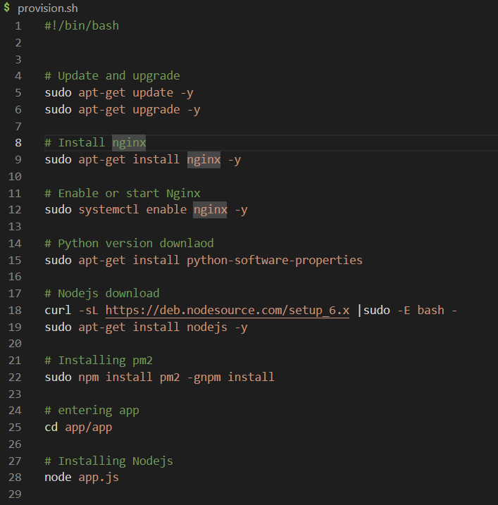
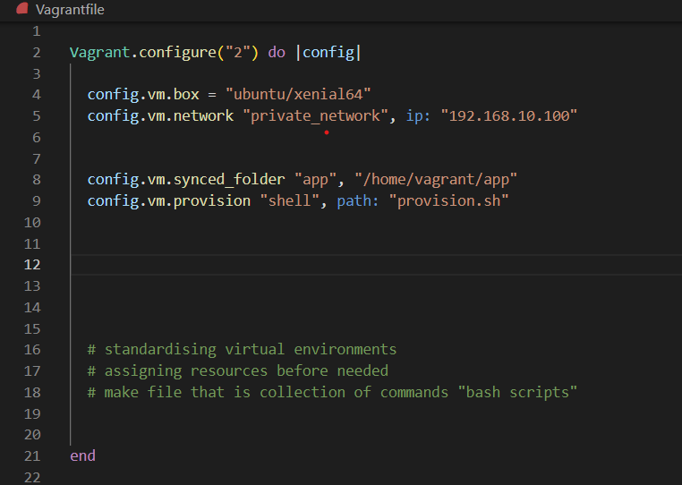
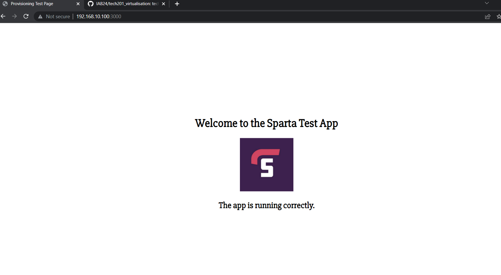
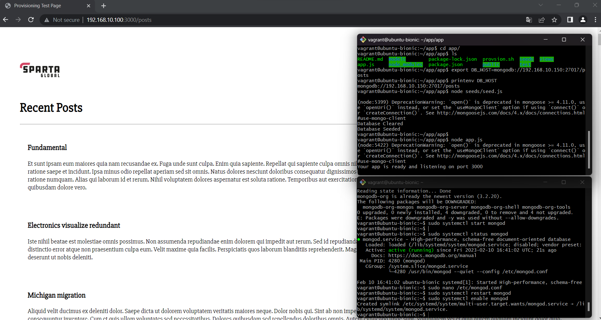

# DevOps and Development Environments

## DevOps

Responsible for tying teams together in software engineering lifecycle. Shared responsibility.

CLOUD
- engine of internet
- very secure (google datacenter)
- protecting user info very important
- warm 80F helps with efficiency
- overhead power distribution
- custom server rack that can be optimised for high speed computing
- drives destroyed if unreliable
- cool water through coils, keep datacenter cool.

4 areas to improve dev ops
- Ease of use:
Other teams wont use the tools we create if they aren't user friendly. If devs do not use our tools there will be headaches and delays in deployment down the line.

- Flexibility:
It can be wasy to get locked in to using a specific product, tool or software. Makes it harder for the company to keep up with industry changes.
Everything should be easy to change and update if needed for the business.

- Robustness:
We need as close to 100% uptime as possible for our company's services.
We are responsible for achieving this as DevOps engineers.

- Cost:
Cost is often overlooked. We need to make sure the company is being as efficient as possibe in it's tech dealings.
For example how powerful a machine fow we need to conduct a task. Do we need certain servers running?etc.

Monoliths - not flexible/or robust

- Risk register:
Highlights risks in system. Outlines potential damages, chance of occurence and risk to business. 


### Development environments
- Space with all the tools and configurations to run and test programs.

- Increases dev team collaboration.

What makes a good dev environment?
- User friendly, fast and robust
- Should be easy to update
- It should match the production environment as closely as possible
- Acessibility. It should be the same for everyone, everywhere. 
- It should support one application - app1 requires version 1.1 - app 2 needs 1.4 
or app1 conflicts with a program app2 needs.


- Virtualisation allows you to set up a dev environment equal for everyone using VMs.

### Tooling/settings

How to set up ruby:
https://rubyinstaller.org/downloads/

How to set up virtual box:
https://www.virtualbox.org/wiki/Download_Old_Builds_6_1

How to set up vagrant:
https://www.vagrantup.com/

Windows hypervisor on


### Vagrant
Create a directory for your project and navigate to it in the terminal.

Initialize the project with a specific base image by running the command vagrant init ubuntu/xenial64. This will create a Vagrantfile in the directory, which is used to configure your virtual environment.

Vagrant file has this code in it in ruby. You will need to delete the comments.

```
Vagrant.configure("2") do |config|

  config.vm.box = "ubuntu/xenial64"


end
```

Start the virtual machine by running the command vagrant up.

Connect to the virtual machine by running vagrant ssh.

ls -a shows hidden files 

sudo apt get update -y

sudo apt-get install nginx -y

sudo systemctl start nginx

sudo systemctl status nginx

```
Vagrant.configure("2") do |config|

  config.vm.box = "ubuntu/xenial64"
  config.vm.network "private_network", ip: "192.168.10.100"


end
```
exit using ctrl c

vagrant reload

type.ip address into browser and you can see these changes have been made.

VMs - emulating an operating system within your own OS


uname - OS system


### Advanced Bash Commands

- Flags: Used in commands to modify their behavior. Common flags include:
  -r: Recursive (applies to a directory and its contents).
  -v: Verbose (provides more detailed information).
  -f: Force (overrides warnings or errors).
  -h: Help (displays information about the command usage).

- `ls`: List the contents of a directory.
  Syntax: ls [options] [directory]
  Options:
    -l: Long format (displays detailed information about each file).
    -a: All (includes hidden files).
    -t: Sort by modification time (newest first).

- `cd`: Change the current working directory. (/ root, ~ home)
  Syntax: cd [directory]
  Options:
    -L: Follow symbolic links.
    -P: Do not follow symbolic links.

- Paths: Two types of paths in bash:
  - Relative path: Specifies a location relative to the current working directory.
  - Absolute path: Specifies a location starting from the root directory.

- `touch`: Create a new empty file or update the modification time of an existing file.
  Syntax: touch [file(s)]

- `nano`: A text editor for the terminal.
  Syntax: nano [file]
  Common commands:
    -Ctrl+O: Save changes.
    -Ctrl+X: Exit nano.
    -Ctrl+W: Search for a word or phrase.

- `mkdir`: Make a new directory.
  Syntax: mkdir [directory]
  Options:
    -p: Create parent directories as needed.

- `rm`: Remove files or directories.
  Syntax: rm [options] [file(s)/directory(ies)]
  Options:
    -r: Remove the contents of a directory recursively.
    -rf: Force removal without prompting for confirmation, including the contents of a directory. Use with caution as it will ignore write-protected files.

 #### Other commands/notes
man ls

man -k change (keyword) brings up  docs with keyword in it

grep test find where keywords are in files

grep test * -R recursive search

wildcards are used to match multiple filenames or pattern of characters, such as * (matches any number of characters) or ? (matches exactly one character). 

They are used in bash commands, such as ls or rm, to operate on multiple files at once.
uname - OS system

VM terminal is not colourful unlike PC


### Linux Permissions

In Linux, every file and directory has permissions that determine who can access and perform actions on them.

Types of permissions:
- Read (r): Permission to read the contents of a file or list the files in a directory.
- Write (w): Permission to modify the contents of a file or add/remove files in a directory.
- Execute (x): Permission to execute a file or access files in a directory.

Users:
- Owner: The user who owns the file or directory.
- Group: A group of users who have common access privileges.
- Others: All other users on the system.

Permission representation:
- A series of 9 characters in the format: rwxrwxrwx
  - The first three characters represent the owner's permissions.
  - The next three characters represent the group's permissions.
  - The last three characters represent the permissions for others.
- If a permission is not set, a '-' is used instead of 'rwx'.

Setting permissions:
- Use the `chmod` command to change the permissions.
  - Numeric mode uses a 3-digit octal number to represent the permissions.
  - Symbolic mode uses letters and operators to represent the permissions.

Examples:
- Give owner read and write, others only read:
  chmod 644 file.txt
- Give owner full, others execute:
  chmod 711 directory/
- Add execute for owner and group:
  chmod u+x,g+x file.sh

  ### Other notes
top (table of processes) lets you see how processes are running in real time.

sleep creates dummy processes. Number signifies time delay before it runs.

kill stops process. kill -9 kills it very quickly

& runs process in the background and lets you use the terminal

ctrl+z stops process

fg brings back to the foreground

tree- allows you to showcasefiles and folders

(sudo apt install tree -y)

gem install bundler

bundle

rake spec - tests against de v env 

### Sparta App

- First you need to `cd` into environment in VS code
- Then `cd` into spec-test
- Then `ls` where you should see a number of files
- Run `gem install bundler` ruby testing framework
- Run `bundle` 
- run `rake spec` this tests your environment
- run `sudo apt - get update -y`
- then run `sudo apt-get upgrade`
- Following this you need to run `sudo apt-get install nginx -y`
- Run `sudo systemctl enable nginx -y`
- Run `sudo systemctl start nginx -y`
- Do another `rake spec` and you will see that there are now only three failures
- Run `sudo apt-get install python-software-properties`
- You need a certain version of nodejs so you need to input `curl -sL https://deb.nodesource.com/setup_6.x | sudo -E bash -`
- Now run `sudo apt get install nodejs -y` for nodejs and jus check that with `nodejs -v` and if we now do a rake spec there will only be one failure left.
- We can now install `sudo apt-get install nodejs -y`
- Check version with `nodejs -v`
- If we now do a `rake spec` there will only be one failure left
-  Now run `sudo npm install pm2 -g` to remove that last failure
- Now run `cd app` twice then run `npm install` to install sparta app
- Run `node app.js` where it should return "Your app is ready and listening on port 3000" on the terminal
- Go to browser and type in "http://192.168.10.100:3000/" where you see the app is running

### Provisioning

- Create a file called `provision.sh`

- Add `#!/bin/bash` to start with to let you know that it is a bash script

- We need to add updates and upgrades so enter `sudo apt-get update -y`
 and `sudo apt-get upgrade -y`
 - Next install nginx by using this input `sudo apt-get install nginx -y`
 - Ensure that nginx is enabled by running `sudo systemctl enable nginx -y`
- For downloading node.js run the following `curl -sL https://deb.nodesource.com/setup_6.x | sudo -E bash -sudo apt-get install nodejs -y`
- Now we need to install pmw and that is achieved by entering `sudo npm install pm2 -gnpm install`

- Ensure that you are in the right folder so `cd` into app
- Install node.js by running `node app.js`
- The full picture


- Next you need to add the provision line to your vagrant folder.


- Enter `vagrant up` in the terminal and the app should be complete.



reverse proxy shows app by default instead of welcome to nginx


- destroy vms
- 2 different ip addresses
- vagrant up - create 2 vms
- app takes longer because it's running provisions
- ssh into app and database
- enter key/ mongodb
- apt get update/upgrade for database
- install mongodb
- change bindIp
- restart/enable mongodb
- status active

- cd into app
- environment variable - dynamically specified variable
- MY_VAR = "name of variable"
- contents echo 
- normal variable only accessible in bash. doesn't exist in vs code. environment variable accessible everywhere.
- export MY_VAR = "x" is how u make env var
- persistent env variable stays there after vm shut down
- bash.rc 
- source
- printenv
- env variable needed on app to specify how to connect  to database.

- export DB_HOST=mongodb://192.167.10.150:27017//posts
- printenv DB_HOST 
- cd app
- npm install
- node seeds/seed.js

